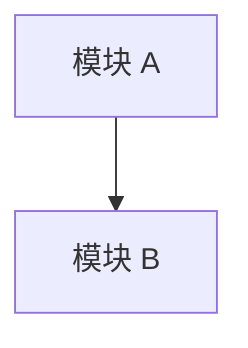

# 模块索引

> **归档来源：** [Tech-Arch.md](../../Tech-Arch.md) §4 自研模块清单、[Dev-Plan.md](../../Dev-Plan.md)
> **填充时机：** `tech-architect` 确定模块清单后创建；`dev-planner` 拆分任务后更新进度
> **最后同步：** <!-- 填写日期 -->

| 模块 | 职责 | 代码路径 | 文档 | 状态 |
|------|------|---------|------|------|
| | | `src/business/<模块>/` | [README](<模块>/README.md) |  开发中 /  完成 |

## 依赖关系

## 开发进度

<!-- 从 Dev-Plan.md 同步 -->

| 阶段 | 状态 | 完成时间 |
|------|------|---------|
| | | |
